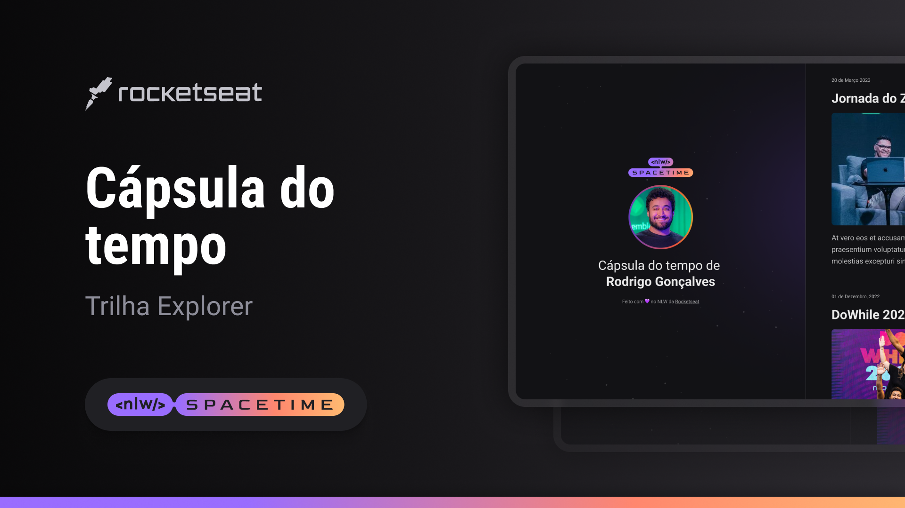

## 🖥️ Projeto

Esse é um projeto web responsivo de uma capsula do tempo para exibir memorias em um linha do tempo.

## 🚀 Tecnologia

Esse projeto foi desenvolvido durante a NLW da Rocketseat com as seguintes tecnologias:

- HTML
- CSS
- Git e Github

## 🏷️ Layout

Você pode visualizar o layout do projeto através [desse link](<https://www.figma.com/file/R96Yn3ZauSX9BuGmmrdRD9/C%C3%A1psula-do-tempo-%E2%80%A2-Trilha-Explorer-(Community)?type=design&node-id=306%3A3&t=D3SFgczEItFm26sT-1>).
É necessario ter um conta no [figma](http://www.figma.com).
